# snappyscreenshots
A small tool written in java to automate the process of taking screenshots of your screen.



# Compilation
Compile the java files in the following order:
```java
$ javac snappyscreenshot/Time.java
$ javac snappyscreenshot/SnappyScreenshot.java
$ javac snappyscreenshot/Main.java
```
# Basic Usage
```shell script
$  snappy-screenshot [--start <start time>] [--stop <stop time>] [--interval <time interval>] [--dir <output directory>] [-h, --help <detailed help>]  [--nos <number of screenshots>]
```
Following options are supported:
```
--dir <output directory>        directory to save the captured screenshots, default location is
                                snappy-screenshots folder in user's pictures folder

-h,--help                       snappy-screenshot detailed help message.

--interval <time interval>      time interval between successive captured screenshots,
                                default value is 2 sec

--nos <number of screenshots>   number of screenshots to take, default value is 5

--start <start time>            start capturing screenshot from the specified time,
                                default value is your current system time

--stop <stop time>              stop capturing screenshot at the specified time
```
# Limitations
Currently works with 24-hour time format only.

# License
Copyright 2019. Released under the MIT license.